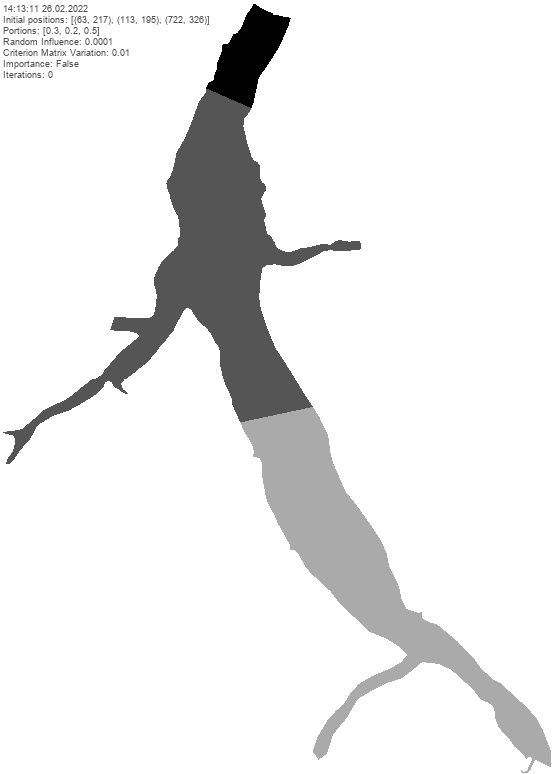
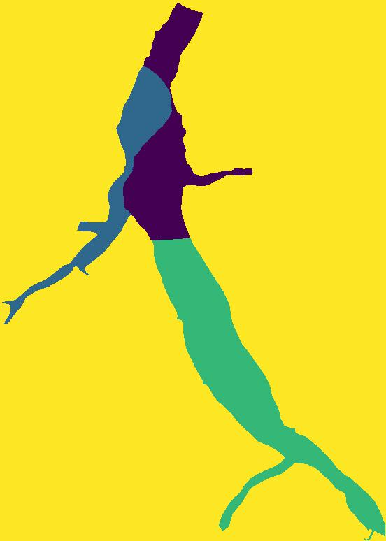
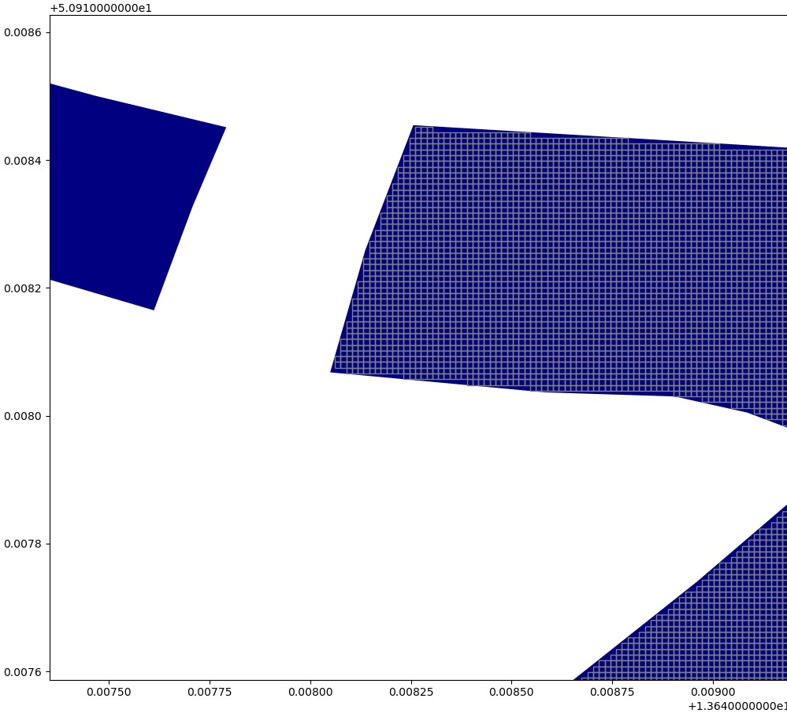

# (Offline) Lake Bathymetry Scanning
This project aims to divide a lake area into several regions, optimize the region size and shape and use path planning to calculate a WGS 84 conform path. This is one step of my universities [RoBiMo project](https://tu-freiberg.de/en/robimo) to automatically scan the subsurface of a lake by a [boat drone](https://www.youtube.com/watch?v=8xZVimh9f-8).
See an example scan in 3D at [sketchfab.com](https://sketchfab.com/3d-models/riesenstein-scientific-diving-center-freiberg-5f30ea70c20e447eb5e121b51e5ae3f7)!

### Motivation & Conditions:

A small boat drone with a bathymetric scanner can only move a certain distance until its battery is empty and needs a refill.
Dividing the lake into regions with a defined number of tiles is one step. Rearranging the grid around every drone's start point by the DARP algorithm in used to find an optimal solution considered the distance of every tile inside the lake area.

After finding the optimal regions a path planning algorithm has to find a way with the lowest number of turns and the highest number of longest possible line segments. This way through every region will be exportable as [WGS 84 (EPSG:4326)](https://en.wikipedia.org/wiki/World_Geodetic_System) path for usage in automatic path finding programs.  

### DARP: Divide Areas Algorithm for Optimal Multi-Robot Coverage Path Planning

This is a fork of the [DARP Python Project](https://github.com/alice-st/DARP) with its Java source the original [DARP Java Project](https://github.com/athakapo/DARP).

Look up the original project for further details, how the algorithm works and all links.

## Current Status

Here is an example of the DARP calculation as animation which shows the ongoing rearranging of tiles every 5th iteration before reaching the final result.

Start parameters have been:
 * lake [Talsperre Malter](https://wiwosm.toolforge.org/osm-on-ol/kml-on-ol.php?lang=de&uselang=de&params=50.921944444444_N_13.653055555556_E_dim%3A1000_region%3ADE-SN_type%3Awaterbody&title=Talsperre_Malter&secure=1&zoom=15&lat=50.92194&lon=13.65306&layers=B000000FTFT)
 * map size `(774, 552)` tiles (every tile's edge length is 3 meter)
 * `(63,217),(113,195),(722,326)` as initial positions meaning 3 drone start points
 * `[0.3, 0.2, 0.5]` have been the portions (_no fixed number of tiles yet_)
 * random influence: `0.0001`
 * criterion variation: `0.01 `
 * importance `False`
 * image_export `True`
 * video_export `True` _(keep in mind: this slows down the iteration speed)_

| Talsperre Malter DARP animation                                                 | Talsperre Malter result image                                 |
|---------------------------------------------------------------------------------|----------------------------------------------------------------|
|  |  |

| Example grid generation                                 |
|---------------------------------------------------------|
|  |

## Installation
You need [Anaconda](https://www.anaconda.com/products/individual#Downloads). Download all necessary packages and libraries by importing the environment `conda_gridding_darp_enviroment.yaml` file inside the Anaconda Navigator.
This creates a fresh environment for this project.

## Run & Setup

To run this project start `multiRobotPathPlanner.py` inside the new environment. Most important triggers and parameters are situated in the `__main__`. The example lake geojson-file above shows "Talsperre Malter.geojson", but I included more example files of lakes in Saxony (Germany) in the `dams_single_geojsons` folder. Saxony completely and another water area only file is included inside `overall_geojsons`.
If you want to play around with your own files I included some code to filter geojson-files with geopandas in the `extract.py` file.

I'll add more code to download and use online geo spacial resources soon. Then it will be possible to choose which lake/area to download from a list or whatever. Still in progress...
At the moment it is only possible to analyze offline geojson-files. Inside the grid generation the geojson-file gets filtered for the biggest area to analyze, but at creation time of the DARP instance it checks for sanity and continuity anyway.   

Set up the impact of the video export inside the DARP to your likings. The video export decreases iteration speed drastically at the moment. So I create and write a video frame every 5th iteration. Increase or decrease this "framerate" inside `video_export_add_frame`. If the assignment steps are not necessary you can turn the video export off in the `__main__` of `multiRobotPathPlanner.py`.

If you don't want to define your initial start points all the time I created `get_random_start_points` helper function to find a defined amount of tiles at the banks of the left side. Always match the number and size of the portions in `__main__` to them.

## Work in Progress - Random Influence

With difficult start parameters like many start points near to each other DARP sometimes struggles in finding an optimal solution on big maps/arrays. In these cases letting it iterate over 150k times won't let it end with success.
My experiments on this matter showed, that using a higher random influence (like 0.0005) show better results at finding global optimums but lack to find connectivity for all tiles before reassigning and rearranging them again.
A lower random influence value (like 0.0001) does this job just fine...
My suggestion is lowering the random influence when hitting a preferable relation of `DesirableAssignments` to current `ArrayOfElements`. I need to find and define a threshold for this kind of check...

## Tasks:
- [x] contributed fix of DARP algorithm to DARP-Python project
- [x] get rid of the element-wise matrix manipulation loops by using numpy
- [x] remove area input size restrictions, now flexible
- [x] clear project of bloat / unused code and array generations (to increase speed)
- [x] gridding of geospacial data of any given lake(area) into tiles with a defined edge length (using [geopandas](https://geopandas.org/en/stable/getting_started/introduction.html) and [shapely](https://shapely.readthedocs.io/en/stable/project.html)) and use as input for DARP
- [x] using python [multiprocessing](https://docs.python.org/3/library/multiprocessing.html) to speed up the grid generation
- [x] generate gif animation and video of calculation process + final assignment matrix image
- [x] speed up DARP calculations by using [numba](https://numba.readthedocs.io/en/stable/index.html)
- [x] optimize (numba jitted) loops to only operate inside relevant tiles inside the grid (speedup)
- [x] normalize Metric Matrix to a range between 0 and 10 if values near system float maximum (atm checking for highest array value smaller than max system float value; checking needs calc time and decreases loop speed)
- [ ] optimize random influence?!
- [ ] take defined number of tiles per drone start point as input (keep alternative `portions`?) and recommend a minimum number of start points
- [ ] transformation of path planning way for every region to WGS 84 path + save to file
- [ ] create and read a settings yaml file which holds all triggers and important values
- [ ] divide area even further: create layers for inner and outer region inside lake area / rework gridding
- [ ] numba speedup for kruskal and path planning?!
- [ ] using multiple processes to calculate different regions of a lake and make calculation more efficient
- [ ] keep usage of pygame? _(optional) build GUI for users to define areas and (number of) layers manually_